# 15个免费AI搜索引擎,告别广告直达答案

---

当你在传统搜索引擎里输入问题,结果页面前三屏都是广告——这种体验大概每个人都经历过。更糟的是,你得自己从一堆链接里翻找答案,像在垃圾堆里淘金。

好消息是,现在有一批AI搜索引擎改变了游戏规则:它们直接给你答案,不绕弯子,不插广告,还会标注信息来源。无论你是写代码查bug、做学术研究找论文,还是单纯想快速了解某个话题,这些工具都能让搜索效率翻倍。本文整理了15个真正好用的免费AI搜索引擎,覆盖通用搜索、编程开发、学术研究等多个场景。

---

## 秘塔AI搜索

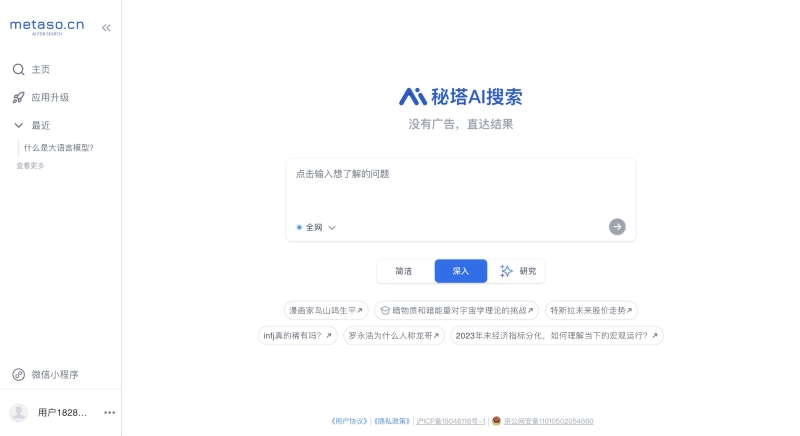

秘塔AI搜索是国内团队开发的AI搜索工具,最大特点是"简洁"——打开页面没有任何多余元素,输入问题后直接给出结构化答案。

它提供三种搜索模式:简洁模式适合快速查询,深入模式会给出更详细的分析,研究模式则会生成学习大纲并聚合相关资料。比如你搜"如何提高睡眠质量",研究模式会自动整理出原因分析、改善方法、注意事项等板块,省去了自己归纳整理的时间。

**核心优势:**
- 零广告干扰,页面清爽
- 信息自动结构化,便于理解
- 支持生成学习大纲,适合深度学习

## Perplexity

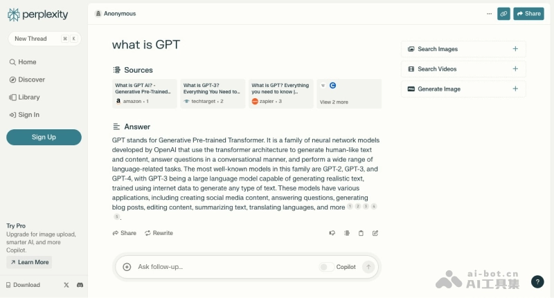

Perplexity是目前最火的AI搜索引擎之一,被称为"ChatGPT+Google"的结合体。它的回答不仅准确,还会在每个关键信息后标注来源链接,方便你核实。

这个工具特别适合需要快速获取可靠信息的场景。比如你问"2024年最新的AI发展趋势",它会从多个权威来源提取信息,生成一份综合报告,并在文中标注每条信息的出处。不需要注册就能使用,👉 [想体验更智能的搜索方式?点这里试试Perplexity](https://pplx.ai/ixkwood69619635)。

**核心优势:**
- 对话式交互,像和人聊天一样自然
- 每个答案都标注信息来源
- 免注册即用,上手零门槛

## 360AI搜索

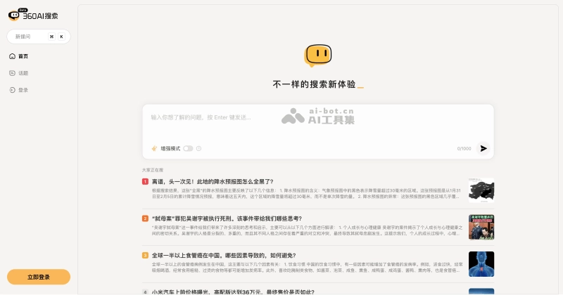

360推出的AI搜索引擎,走的是"深度分析"路线。它会先拆解你的问题,理解你真正想问什么,然后从海量网页中提取最有价值的信息,最后生成一份逻辑清晰的答案。

增强模式是它的特色功能——系统会主动追问你需要哪些细节,然后提供更精准的回答。比如你问"如何选购笔记本电脑",它可能会追问你的预算、用途、品牌偏好等,最后给出定制化建议。

**核心优势:**
- AI深度分析问题,理解用户真实意图
- 增强模式支持多轮追问
- 智能排序算法,快速定位关键信息

## 天工AI搜索

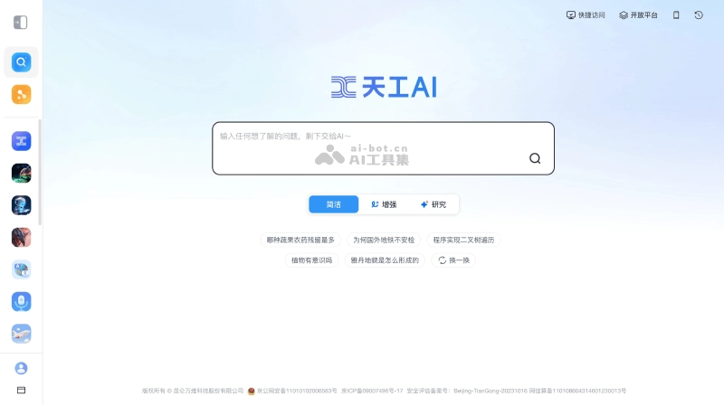

昆仑万维出品的天工AI搜索,最大亮点是"追问"功能做得很顺滑。你可以像和朋友聊天一样,一个问题接一个问题地深挖下去,系统会记住上下文,不需要重复背景信息。

它还支持行程规划辅助——比如你问"去成都三日游怎么安排",它会根据景点位置、开放时间、交通情况等因素,生成一份可行的行程表。未来还会支持图片和语音搜索,更加方便。

**核心优势:**
- 支持多轮深度追问,上下文连贯
- 个性化搜索,根据用户习惯定制结果
- 行程规划功能实用,适合旅行场景

## Flowith

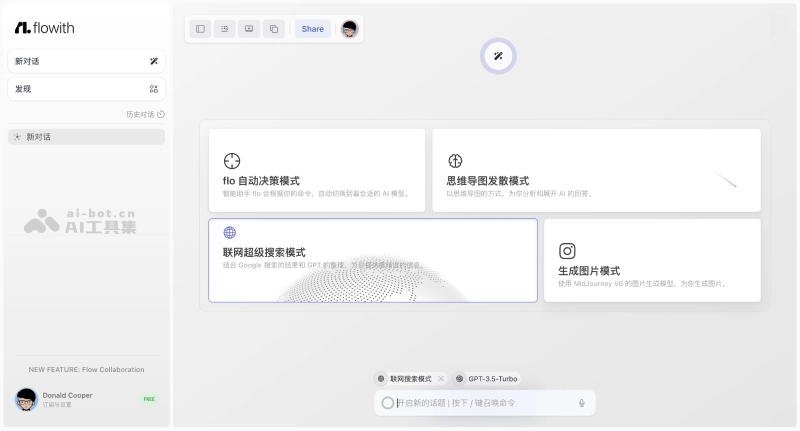

Flowith是个"另类"的AI搜索工具——它用节点式交互代替传统的线性对话。你可以在一个无限画布上创建多个节点,每个节点代表一个问题或主题,然后自由连接它们,构建自己的知识图谱。

这种方式特别适合发散性思维。比如你在研究"人工智能伦理",可以同时开多个节点探讨技术风险、法律监管、社会影响等不同角度,最后把它们串联起来,形成完整的思考框架。它还支持多种AI模型(GPT-4、Claude 3等)和图像生成功能。

**核心优势:**
- 节点式交互,支持多线程思考
- 可选多种AI模型,灵活切换
- 支持文件上传分析,自带OCR功能
- 智能体市场,可共享和获取他人创建的工具

## Devv

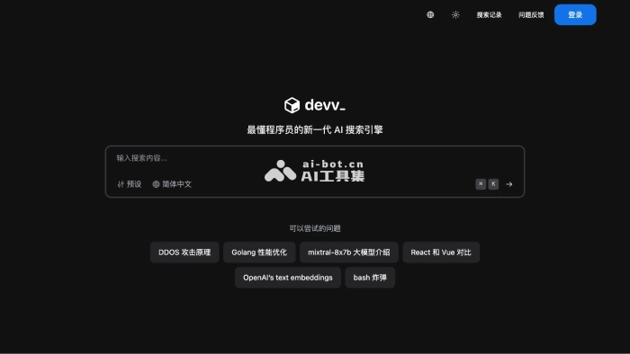

Devv是专门为程序员设计的AI搜索引擎。它预设了Python、Go、JavaScript、Java等10多种编程语言,你可以直接问技术问题,比如"Python如何处理异步请求"或"React Hooks最佳实践",它会给出代码示例和详细解释。

虽然定位是编程工具,但其实你也可以用它搜索任何问题。它的回答简洁专业,不会像有些AI那样啰嗦半天说不到重点。支持连续对话,并且会标注参考来源。

**核心优势:**
- 专注编程领域,技术问题解答精准
- 预设多种编程语言,快速切换
- 支持连续对话,上下文理解能力强

## Globe Explorer

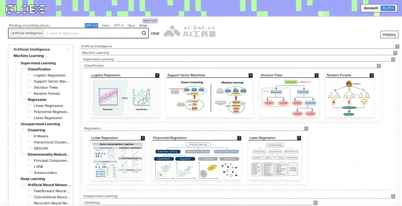

Globe Explorer的特色是"视觉化搜索结果"——它会自动生成思维导图和树状大纲,帮你快速把握信息结构。比如你搜"区块链技术",它会展示一个知识图谱,包含技术原理、应用场景、发展历程等分支,点击任意节点可以深入了解。

它支持跨领域整合,覆盖工程、科学、艺术等多个领域,并且内置多种AI模型(GPT-3.5、GPT-4等),可以根据需要选择。多语言支持也做得不错,无论你用中文还是英文搜索,都能获取高质量内容。

**核心优势:**
- 自动生成思维导图,信息结构一目了然
- 跨领域整合,适合深度探索
- 多语言支持,无语言障碍

## 博查AI搜索

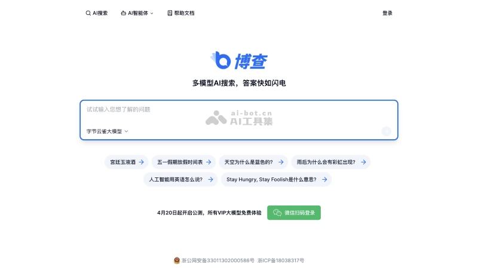

博查AI搜索是国内首个支持多模型的AI搜索引擎,整合了通义千问、字节云雀、Kimi等多个大模型。你可以根据问题类型选择不同模型——比如需要长文本理解时用Kimi,需要快速响应时用通义千问。

它的实时信息获取能力很强,能解决传统AI知识库更新滞后的问题。每个搜索结果都配有明确的参考来源,确保信息可靠。目前还在内测AI智能体深度回答功能,据说能提供更丰富的答案。

**核心优势:**
- 支持多模型切换,灵活应对不同需求
- 实时信息获取,知识库更新及时
- 无广告、无追踪,搜索环境纯净

## Reportify

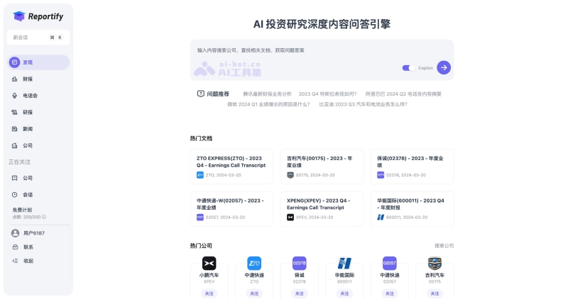

Reportify是专门为金融分析师设计的AI搜索工具,能快速分析财务报告、新闻、音频和视频资料。它的问答助手支持中英文,可以理解复杂的金融问题,并提供引用来源。

文档阅读功能很实用——上传一份财报或研究报告,它会自动总结要点,还能提供全文翻译。内容聚合功能会整合上市公司的财报、会议记录和新闻,形成信息流,方便追踪特定公司或行业动态。

**核心优势:**
- 专注投资研究领域,金融问题解答专业
- 自动总结报告要点,提升阅读效率
- 聚合多源信息,便于追踪行业动态

## Phind

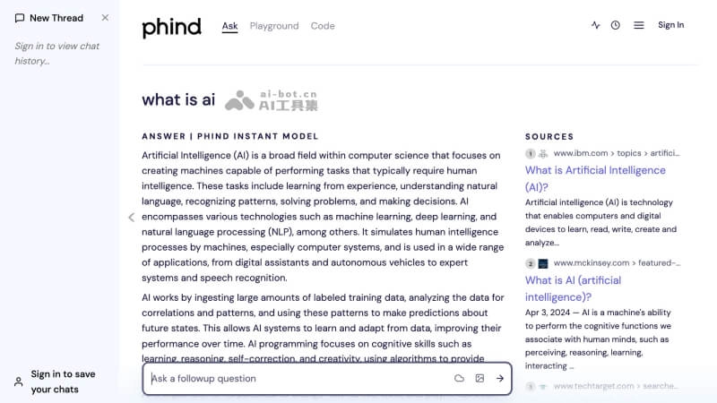

Phind是另一个面向开发者的AI搜索引擎,在解决编程问题方面表现出色。无论是基础语法还是高级算法,它都能给出详尽的解答。它提供三种搜索模式:专业模式适合复杂问题,简洁模式快速获取答案,创造性模式则会提供多种解决方案。

界面设计很简洁,没有多余元素,让你专注于搜索和解答。它还支持时间筛选功能,可以按特定时间范围搜索,快速定位最新信息。历史搜索管理也做得不错,方便回顾之前的查询。

**核心优势:**
- 编程问题解答详尽,覆盖基础到高级
- 多模式搜索,适应不同查询需求
- 时间筛选功能,快速定位最新信息

## iAsk AI

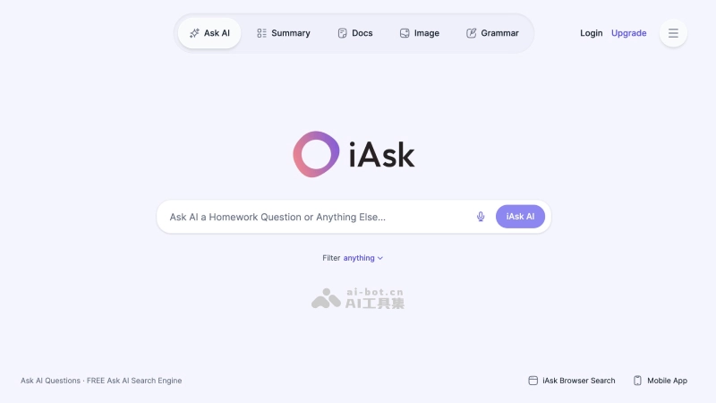

iAsk AI使用先进的自然语言处理技术和大规模Transformer模型,提供快速、准确且无偏见的搜索结果。它的特点是"客观"——不会因为商业利益或算法偏好影响搜索结果,适合寻求事实真相的用户。

它支持多算法搜索,可以根据查询类型选择不同算法——比如查维基百科、书籍、新闻或学术资源。内容篇幅可以自定义,你可以选择生成简短摘要或详细报告,适应不同信息需求。

**核心优势:**
- 无偏见服务,提供客观答案
- 多算法搜索,灵活选择信息源
- 内容篇幅可自定义,适应不同需求

## Consensus

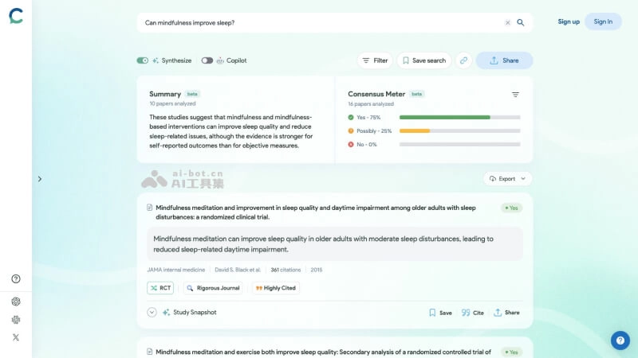

Consensus是专门为科研人员设计的AI搜索引擎,提供超过2亿篇科学论文的访问。你可以用自然语言查询,比如"咖啡因对认知功能的影响",它会从海量文献中提取相关研究,并总结关键发现。

它的学术写作辅助功能很强大——支持从引言到文献综述的写作,并自动完成文献引用和格式化。研究空白分析功能可以揭示当前研究的不足,指导未来研究方向。适合研究人员、学生、医疗专业人员等需要深度学习的用户。

**核心优势:**
- 海量文献资源,覆盖广泛学科
- 智能提取关键信息,节省阅读时间
- 学术写作辅助,自动完成引用和格式化

## ThinkAny

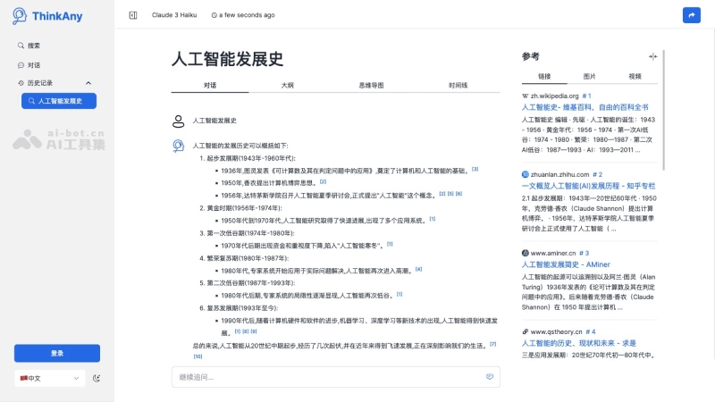

ThinkAny使用先进的RAG技术,能快速检索和聚合互联网上的优质内容。它的智能问答系统利用深度学习和自然语言处理,理解用户提问并给出简洁、准确的答案。

个性化搜索体验是它的亮点——系统会根据你的搜索习惯和偏好定制化结果。它还配备思维导图功能,帮助你组织和理解信息。多语言支持做得不错,支持中文、英文等多种语言,界面无广告,清晰直观。

**核心优势:**
- RAG技术,提供精确搜索结果
- 个性化搜索,根据用户习惯定制
- 思维导图辅助,帮助组织信息

## Andi

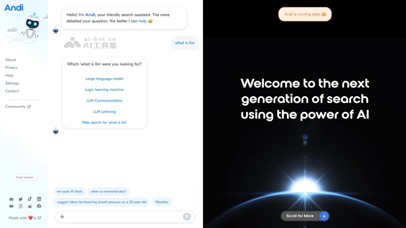

Andi AI是一个对话式AI搜索引擎,使用生成式AI技术直接给出问题的答案,而不是一堆链接。它的交互体验很自然,感觉像是在和一个知识渊博的朋友对话。

它以卡片形式展示搜索结果,视觉效果清晰。一键摘要功能可以快速提炼信息要点,提升筛选效率。深
